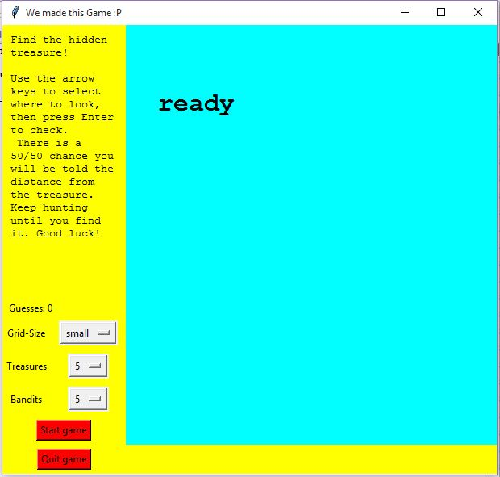
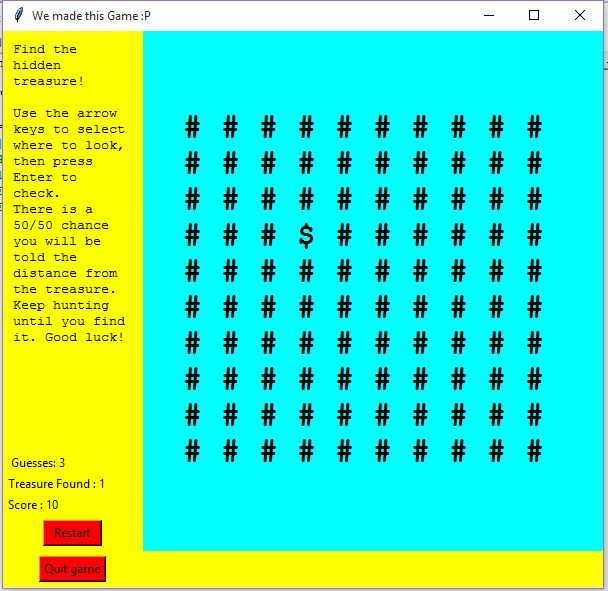

# gold_n_bugler_game
Python Tkinter GUI  game implementation
### Requirements
* [Python 2.7](https://www.python.org/download/releases/2.7/) or Python 3.0

### Python Modules Required
* All comes in standard library packages no need to install others

### ScreenShot 

